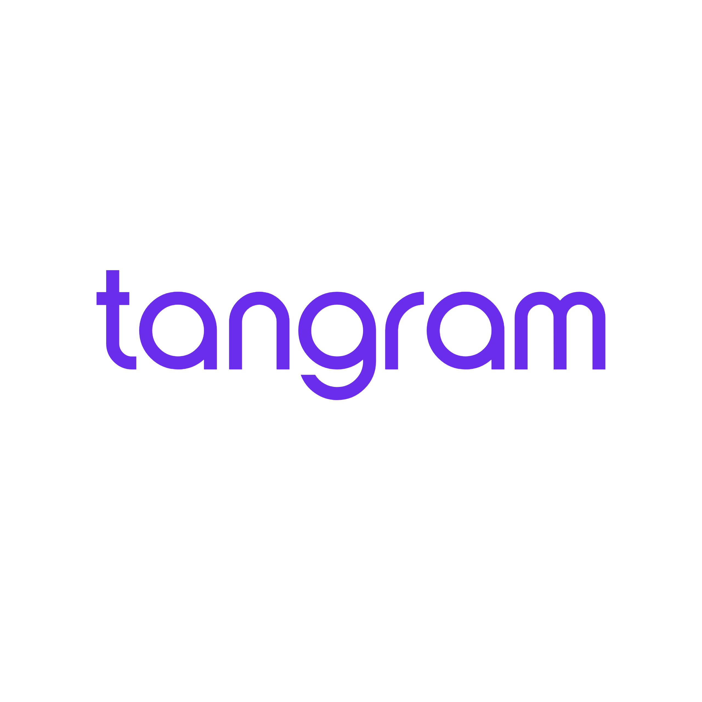

# 🎯 Tangram - Plataforma de Tecnologia Educacional

> Transformando a educação através de experiências digitais inovadoras e aprendizado gamificado

## 🌟 Visão Geral

O Tangram é uma plataforma abrangente de tecnologia educacional projetada para revolucionar a experiência de aprendizado através de desafios interativos, gamificação e ferramentas educacionais colaborativas. Nossa solução conecta a educação tradicional com o engajamento digital moderno, fornecendo aos educadores e estudantes ferramentas poderosas para melhorar os resultados de aprendizagem.

# 1: Problema e proposta de valor

### **Problema**

A educação financeira se tornou obrigatória nas escolas brasileiras com a BNCC (Base Nacional Comum Curricular), sendo especialmente associada à disciplina de Matemática. Cerca de 25% das habilidades de matemática podem ser trabalhadas nesse contexto. No entanto, as escolas têm dificuldade em implementar esse tema:

- **Falta de competência dos professores:** Muitos docentes, sobretudo os de matemática, não dominam os conteúdos de finanças e sentem-se inseguros em abordar o tema.
- **Desinteresse dos alunos:** A abordagem tradicional não conecta com a realidade dos estudantes, gerando baixa participação e engajamento.

### **Para quem**

- **Professores de matemática** que precisam cumprir a BNCC, mas não têm tempo para estudar, formação ou recursos didáticos adequados.
- **Alunos do Ensino Fundamental e Médio**, que muitas vezes têm resistência a temas abstratos e pouco aplicáveis do currículo, especialmente quando se trata de finanças e matemática.

### **Proposta de Valor**

A Tangram transforma a educação financeira em uma experiência gamificada, divertida e prática, totalmente alinhada à BNCC: **Descomplicada para o professor e envolvente para o alunos.** 

É um programa digital que permite aos professores trabalharem habilidades de matemática no contexto de educação financeira por meio de situações reais e lúdicas, com alto engajamento dos alunos e facilidade de aplicação para os educadores.

O sucesso da plataforma depende de um ponto crucial: **ser simples para o professor de matemática aplicar dentro da escola** — especialmente porque muitos deles não dominam o conteúdo de educação financeira. Por isso, a Tangram **não exige que o professor seja um transmissor do conteúdo**, e sim um **facilitador da experiência de aprendizagem**. A própria plataforma conduz o processo de ensino-aprendizagem, oferecendo **devolutivas imediatas das respostas aos estudantes.** Com isso, o papel do educador passa a ser acompanhar, apoiar e incentivar os alunos, sem sobrecarga ou necessidade de preparo extra.

### **Diferenciais Tangram**

**Para os professores:** O grande diferencial da Tangram está em reduzir o tempo de preparação das aulas e correção dos exercícios. A plataforma foi projetada para que o professor atue como facilitador, mesmo sem dominar o tema de educação financeira.

- Não é preciso criar aulas, corrigir exercícios ou preparar avaliações.
- Todo o conteúdo já vem pronto, com trilhas pedagógicas alinhadas à BNCC.
- Painéis com desempenho dos alunos de cada turma;

**Para os alunos:** A Tangram transforma o aprendizado em um jogo:

- Cada fase é um desafio prático com aplicação no dia a dia.
- Os acertos rendem tangrans (moeda virtual), rankings e *gift cards*.
- Mesmo quem não gosta de matemática se envolve, porque a experiência é divertida, competitiva e recompensadora.

### Evidências de impacto

Nossa tese que é o sucesso da educação financeira nas escolas depende do professor perceber um grande valor na solução — e isso ocorre de duas formas:

1. **Aula mais fácil de aplicar que uma aula tradicional de matemática**, com menor tempo de preparação da aula e sem necessidade correção de exercícios e provas.
2. **Turma mais engajada**, com estudantes interessados e participativos, mesmo os que costumam rejeitar o conteúdo de matemática.

Por isso, a Tangram transforma o professor em um facilitador da aprendizagem, e não em um transmissor de conteúdo. A plataforma assume a função de conduzir a experiência pedagógica por meio de: (1) gamificação estruturada; (2) devolutivas imediatas e automáticas e (3) painel com métricas visíveis para o professor.

Com isso, a Tangram reduz a carga de trabalho do professor, melhora o clima da sala e eleva o interesse do estudante.

Como a Tangram trabalha habilidades da BNCC em matemática por meio da educação financeira, ela ajuda a melhorar a relação dos alunos com a disciplina e pode contribuir diretamente para o aumento das notas nas avaliações externas.

Em resumo, a Tangram é uma solução de educação financeira com impacto duplo: **reduz o esforço do professor e melhora o desempenho dos alunos — inclusive em matemática**.

**Evidências de Impacto:**

- **Taxa de renovação de 100% em 2025**: todas as escolas particulares que adotaram a Tangram em 2024 decidiram continuar no ano seguinte.
- **Setor Público:** Renovação do Contrato na Secretaria Municipal de Nova Lima para 2 Escolas Públicas (850 alunos);
- **Engajamento em sala de aula**: professores utilizam a plataforma ativamente nas aulas e mais de 85% dos alunos completam as fases propostas.

# 2: Metodologia

A solução da Tangram se baseia nos **princípios da metodologia ativa,**  que orientam práticas pedagógicas nas quais os alunos assumem papel central no processo de aprendizagem, promovendo **autonomia, protagonismo e aprendizagem baseada em desafios reais.** 

| **Pilares da Solução da Tangram** | **Pilares da Metodologia Ativa** |
| --- | --- |
| **1. Gamificação:** Engajamento com mecânicas como sequências de desafios, disputas em rankings e recompensas com gift cards. | **- Engajamento e motivação:** rankings por equipes e desafios promovem dinâmicas sociais em sala, favorecendo o desenvolvimento de competências socioemocionais. |
| **2. Storytelling:** Desafios com histórias envolventes que criam conexões emocionais e tornam o aprendizado mais memorável. | **- Aprendizagem ativa e prática:** os alunos resolvem problemas contextualizados do dia a dia, aplicando conhecimentos de matemática e finanças em situações concretas. O conteúdo é sempre contextualizado. A teoria faz sentido porque é aplicada a situações reais, aumentando o engajamento e a retenção. |
| **3. Devolutiva imediata:** Feedback instantâneo a cada resposta - permite que o aluno reflita, aprenda com os erros e avance de forma autônoma - sem a necessidade do professor | **- Mediação ativa do professor:** É um mediador da experiência: propõe desafios, provoca questionamentos e orienta caminhos de descoberta.  **- Avaliação formativa e contínua:** A avaliação não acontece só ao final, mas durante todo o processo. O foco é no desenvolvimento do aluno, com feedbacks frequentes e oportunidades de melhoria. |

A  gamificação é baseada na Teoria da Autodeterminação (Deci & Ryan, 1985), que sugere que a motivação intrínseca é impulsionada por três necessidades psicológicas básicas: autonomia, competência e relacionamento. Incorporar elementos de jogos no aprendizado atende a essas necessidades, tornando o processo mais envolvente e motivador. Um estudo do Portal Porvir apontou que 90% dos alunos estão insatisfeitos com as aulas da escola. Por outro lado, um estudo de Hamari et al. (2014) mostrou que a gamificação pode aumentar a motivação e o engajamento dos estudantes, levando a melhores resultados de aprendizado.

Atualmente na plataforma da Tangram, as devolutivas **são imediatas, mas não são personalizadas.** Implementar a **correção automática de questões discursivas com feedback imediato e personalizado para cada aluno** representa um avanço pedagógico significativo. Essa funcionalidade permitirá que o estudante vá além da simples memorização ou reprodução de conteúdo.

Ao responder questões abertas, ele precisa organizar suas ideias, ativar conhecimentos prévios, elaborar argumentos e identificar lacunas no próprio entendimento — habilidades cognitivas superiores segundo a **Taxonomia de Bloom**, como analisar, sintetizar e avaliar. Esse processo resulta em uma maior **retenção do aprendizado.**

Pesquisas, como as de [Rosenshine (2012)](https://www.aft.org/sites/default/files/Rosenshine.pdf), comprovam que responder a questões discursivas melhora o aprendizado por exigir raciocínio, reflexão e articulação de ideias — enquanto questões fechadas avaliam principalmente reconhecimento ou memorização (veja evidências abaixo). Por isso, queremos testar e validar a hipótese de que:

> ***Feedbacks imediatos e personalizados em respostas discursivas, por meio de inteligência artificial, aumentam o aprendizado.***

### [Rosenshine (2012)](https://www.aft.org/sites/default/files/Rosenshine.pdf)- Evidências que responder a questões discursivas melhora o aprendizado.

*Nota: As imagens com evidências de Rosenshine estão disponíveis na documentação de referência.*

# 3: Mapa competitivo

**Análise visual ou descritiva da posição frente a concorrentes diretos e indiretos. Quem são os concorrentes? Como é a diferenciação?**

**Concorrentes:**

| Tipo de concorrência | Exemplos  | Negócio | Características dos Concorrentes |
| --- | --- | --- | --- |
| **Diretos** Soluções de Educação Financeira | Gênio das Finanças, Oficinas de Finanças, Forme, DSOP. | B2B | Livros ou apostilas, com material pouco digitalizado. Alta dependência do professor ou mediador. Baixo engajamento dos alunos devido ao formato tradicional e pouco interativo. |
| **Diretos** Plataformas de Educação Financeira | Mooney, Tindin | B2B  | Plataformas dependem fortemente do professor como transmissor de conteúdo, sem foco na praticidade para o docente. Pouco práticas, não oferecem avaliações ou recursos de apoio pensados para facilitar o trabalho do professor. |
| **Indiretos** Plataforma de Matemática ou Gamificadas | Matific; EducaCross; Jovens Gênios. | B2B e B2G | - Plataformas já bem posicionadas em redes públicas e privadas, com boa experiência técnica e comercial. Trabalham habilidades matemáticas com forte componente lúdico, mas não abordam educação financeira de forma estruturada. - Vendem para o setor público. |

**Diferenciais da Tangram:**

- **Diferenciais da do Produto:** O sucesso da educação financeira nas escolas depende de o professor perceber um grande valor na solução — e isso acontece de duas formas:
    - Menos esforço e mais praticidade: a aula com Tangram é mais fácil de aplicar do que uma aula tradicional de matemática. O professor não precisa preparar conteúdo, criar provas ou corrigir exercícios — a plataforma automatiza tudo isso. Com devolutivas automáticas para os alunos e relatórios gerados em tempo real, o professor atua como facilitador da experiência, mesmo sem dominar o tema de finanças.
    - Desenvolvimento de habilidades de matemática da BNCC: Facilita a aplicação em sala, engaja professores de matemática e agrega valor para as redes públicas, já que as habilidades de matemática impactam diretamente nos indicadores de qualidade educacional do município.
    - Turma mais engajada: os estudantes enxergam a plataforma como um jogo, o que torna a experiência divertida, contextualizada e motivadora. Mesmo os alunos que não têm muita afinidade com a matemática se envolvem com os desafios, que trabalham habilidades da BNCC de forma aplicada ao cotidiano. Rankings, recompensas e *gift cards* estimulam ainda mais a participação.
- **Diferencial Comercial - A Olimpíada Tangram:** um produto estratégico que diferencia a Tangram no mercado educacional ao reduzir barreiras de entrada e criar relacionamentos com escolas e secretarias de educação. Por ser um formato valorizado pelas escolas e secretarias municipais de educação, com alta adesão e fácil implementação, a Olimpíada permite que a plataforma seja testada de forma prática, sem exigir mudanças na grade curricular ou esforço adicional dos professores. Esse primeiro contato é fundamental para ganhar confiança das escolas e secretarias de educação.

# 4: Perfil do cliente ideal e jobs-to-be-done

**Descrição do cliente-alvo, usuários-alvo (quando não forem os mesmos que os clientes) e das dores principais deles que a solução resolve.**

- Cliente-alvo: Escolas Particulares ou Secretarias de Educação (municipais e estaduais) que não possuem estrutura para criar o próprio currículo de Educação Financeira.
- Usuários-alvo: Estudantes e professores (especialmente de Matemática), que atuam do 3º ano do Ensino Fundamental à 3ª série do Ensino Médio.

**Dores Principais que a solução Tangram resolve:**

- Para Escolas e Secretarias de Educação: A obrigatoriedade da inclusão da educação financeira na Base Nacional Comum Curricular (BNCC) impõe um desafio de implementação, especialmente em escolas públicas que necessitam de soluções de fácil implementação para professores que não são dominam o tema;
- Para Professores:  Professores gastam muito tempo preparando aulas sobre um tema que não dominam e têm dificuldade em conectar a matemática ao dia a dia dos alunos no contexto da educação financeira.
- Para os alunos: Estudantes pouco motivados, pois não veem sentido no que estão aprendendo devido à falta de engajamento com métodos tradicionais e falta de clareza sobre a utilidade do conteúdo.

| **Principais Jobs to be Done** | **Funcionais** | **Emocionais e Sociais** |
| --- | --- | --- |
| **Professores**  | 1. Quero ensinar educação financeira mesmo sem ser especialista no tema. 2. Quero gastar pouco tempo na preparação das aulas de educação financeira 3. Quero engajar meus alunos em um tema que normalmente eles acham chato. 4. Quero mostrar resultados concretos para a coordenação/pais/gestão. | 1. Quero me sentir seguro ao trabalhar um tema novo na sala de aula. 2. Quero ser reconhecido como um professor inovador, como alguém que os prepara para a vida, não só para a prova. |
| **Alunos** | 1. Quero aprender a lidar melhor com o meu dinheiro do dia a dia. 2. Quero entender de forma simples como economizar, gastar e planejar. 3. Quero saber como ganhar dinheiro de uma forma prática. | 1. Quero sentir que sou capaz de tomar decisões financeiras sozinho. 2. Quero me sentir inteligente e respeitado por entender de um assunto que até adulto tem dificuldade. |

# Produto e Tecnologia – Arquitetura de produto e utilização de IA

**Diagrama detalhado da utilização de IA + explicação de onde a IA é utilizada no produto, por que meio/método, e como a solução depende desse uso de IA**

O Diagrama apresenta todas as funcionalidades da plataforma Tangram que envolve IA generativa, incluindo:

**1- Produto Atual:** a correção das perguntas do Desafio "Você é o Criador"

**2- Produto com Aliança IA:** a correção automática de questões discursivas e a geração de insights do desempenho da turma para acompanhamento pedagógico.

Acreditamos que a arquitetura utilizada no "Você é o Criador" pode ser reaproveitada para a correção automatizada de discursivas, com adaptações pontuais.

*Nota: O diagrama detalhado da arquitetura de IA está disponível na documentação de referência.*

## 1. **Arquitetura Geral da Solução com IA**

| **Onde IA é utilizada** | **Status** |
| --- | --- |
| 1. **Perguntas com Múltipla Escolha e Plano de Aula** Apoiar o time Learning na criação do conteúdo na plataforma. | Em uso (Chat GPT) |
| 2. **Você é o Criador** Corrigir questões criadas por alunos, com devolutiva imediato | Em desenvolvimento |
| **3. Correção das Respostas das Perguntas Discursivas** Avaliar respostas das questões discursivas enviadas pelos estudantes | **Roadmap - Aliança IA** |
| 4. **Insights do desempenho para acompanhamento dos professores** Gerar relatórios de desempenho de desempenho individual e da turma com insights das perguntas discursivas | **Roadmap - Aliança IA** |

## 2. **Dependência Estratégica da Solução em Relação à IA**

Atualmente na plataforma da Tangram, as devolutivas das questões de múltipla escolha **são imediatas, mas não são personalizadas.**

Implementar a **correção automática de questões discursivas com feedback imediato e personalizado para cada aluno** representa um avanço pedagógico significativo. 

Essa funcionalidade permitirá que o estudante vá além da simples memorização ou aplicação do conteúdo.

Ao responder **questões abertas,** o estudante identifica  lacunas no próprio entendimento ao organizar suas ideias, ativar conhecimentos prévios e elaborar argumentos.

Essas são as habilidades cognitivas mais avançadas segundo a **Taxonomia de Bloom**: **analisar, avaliar e criar**. 

Desenvolver essas competências exige que o aluno vá além da memorização e realmente processe, conecte e transforme o conhecimento. É nesse nível mais alto onde ocorre a **maior retenção do aprendizado**.

Por isso, queremos testar a hipótese de que:

## O **uso da inteligência artificial para oferecer feedback personalizado em questões abertas** aumenta o aprendizado.

Ao receber respostas adaptadas ao que cada estudante produziu, ele é estimulado a refletir, revisar e aprimorar sua própria construção — o que leva, de fato, a um aprendizado mais profundo e duradouro.

Alguns dos benefícios do uso da IA são:

- **Escalabilidade**: corrigir automaticamente milhares de respostas abertas, especialmente em avaliações em larga escala como a Olimpíada.
- **Eficiência**: elimina necessidade de correções manuais, economizando tempo e recursos dos professores
- **Engajamento**: feedback imediato gera maior motivação e aprendizagem significativa.
- **Maior retenção de aprendizado**: permite desenvolver habilidades de **nível superior da Taxonomia de Bloom**

| **Elemento das** questões abertas (discursivas) | **Sem IA** | **Com IA** |
| --- | --- | --- |
| Correção e feedback para o aluno | - Manual e lenta - Inviável em escala - Professor precisa corrigir cada questão individualmente | - Automática, imediata, escalável - Viável para milhões de alunos simultaneamente - Professor não precisa corrigir as questões |
| Relatórios para professores | -  Professor precisa fazer a análise para cada aluno e turma | - Insights personalizados para cada aluno e turma |

# 8: Rotina Escolar – Descrição das etapas e recursos necessários para implementação, uso e conclusão do uso do produto na rotina escolar

**Descrição de como o produto é a implementação/setup e treinamento do produto; como é a utilização recorrente do produto na escola; e como é o pós-implementação (se houver um relatório ou reunião ao fim do ciclo, por exemplo, como seria?). Nas 3 etapas, descrever a duração, recursos e etapas que a edtech e os gestores escolares/professores precisarão passar, como treinamentos, reuniões e/ou coletas específicas, para que o produto seja bem utilizado.**

### 1. **Implementação / Setup e Treinamento Inicial**

- A implementação da Tangram começa com uma reunião de alinhamento entre a Tangram e a equipe gestora da escola, com foco nos objetivos pedagógicos, estrutura de aulas e uso da plataforma. Em seguida, é realizado um **treinamento inicial com os professores que utilizarão a plataforma**, com duração média de 90 minutos, que pode ser presencial ou online. Esse treinamento apresenta: a proposta pedagógica da Tangram; o uso do painel do professor (dashboard); o acesso dos alunos via dispositivos (celular, tablet ou computador); a dinâmica das aulas com base nos planos prontos fornecidos.
- A escola envia para a Tangram uma planilha com o nome completo e e-mail ou número de matrícula dos alunos, com a divisão por turma e o professor responsável por cada turma.

### 2. **Utilização Recorrente na Escola**

- Oferecemos sistema de ensino de educação financeira com 40 aulas semanais para o ano letivo de cada série. O professor recebe um **plano de aula estruturado**, e os alunos têm **acesso à plataforma,** onde podem aprender de forma interativa. Além disso, o professor acompanha o progresso e o desempenho dos alunos em um **painel (dashboard).**
- As aulas são distribuídas em formatos diagnósticas, formativas e somativas, permitindo que o professor avalie o impacto da solução no aprendizado dos alunos ao final de cada módulo. A cada aula, ele pode consultar o currículo, entender o objetivo da aula e acessar conceitos essenciais para introduzir o tema aos alunos, antes do uso da plataforma.
- Durante o programa anual, a Tangram é utilizada **uma vez por semana.** Cada aula segue uma estrutura padrão:
    1. **Planejamento prévio do professor** com base no plano de aula fornecido;
    2. **Abertura da aula**, com explicação do tema e conceitos-chave;
    3. **Uso da plataforma pelos alunos**, com feedback imediato a cada resposta;
    4. **Acompanhamento em tempo real pelo professor**, via dashboard;
    5. **Fechamento e discussão coletiva**, reforçando pontos de atenção.
- Ao final de cada módulo de quatro aulas, eles participam da Oficina Tangram, um momento para colocar em prática o que aprenderam. Nessa oficina, os alunos aplicam os conceitos estudados, criando orçamentos pessoais ou para empresa, desenvolvendo campanhas de conscientização ou escrevendo uma redação sobre o tema.
- No fim de cada mês, o professor entrega ao aluno que acumular mais tangrans em cada série um gift card escolhido na plataforma (iFood, Uber, etc.). O ranking é reiniciado mensalmente para manter todos motivados.

### 3. **Pós-Implementação**

- A Tangram oferece **suporte diário aos professores**, disponível via **WhatsApp ou e-mail**.
- **Ao final de cada semestre**, é realizada uma **reunião com a equipe da escola**, na qual a Tangram apresenta um **relatório de desempenho consolidado da turma**, contendo:
    - dados de engajamento dos alunos por turma;
    - destaque dos alunos por série;
    - evolução da turma (% de acertos das fases diagnóstica, formativas e somativa;
    - recomendações pedagógicas.
    
    Durante essa reunião, são discutidos os **avanços, desafios e possíveis ajustes no uso da plataforma**. Se necessário, podem ser agendadas **formações complementares** ou **oficinas práticas com os professores**, com base no feedback da escola.

## 🚀 O que torna o Tangram Especial

### 🎮 Experiência de Aprendizado Gamificada
- **Desafios Interativos**: Desafios educacionais envolventes que tornam o aprendizado divertido e competitivo
- **Acompanhamento de Progresso**: Monitoramento de progresso em tempo real e sistemas de conquistas
- **Classificações e Rankings**: Sistemas de ranking motivacionais que encorajam competição saudável
- **Sistemas de Recompensa**: Recompensas digitais e reconhecimento por marcos de aprendizagem

### 👥 Educação Colaborativa
- **Aprendizado em Equipe**: Fomenta colaboração através de desafios em equipe e atividades em grupo
- **Integração Escolar**: Integração perfeita com instituições educacionais
- **Dashboard do Educador**: Ferramentas abrangentes para professores e administradores
- **Mapeamento de Jornadas**: Caminhos de aprendizado personalizados adaptados às necessidades individuais

### 📱 Acessibilidade Multi-Plataforma
- **Aplicativo Mobile**: Aplicativo nativo para iOS e Android
- **Plataforma Web**: Aplicação web responsiva para acesso desktop e tablet
- **Back Office**: Portal administrativo para educadores e administradores

## 🏗️ Arquitetura da Plataforma

### Componentes Principais

#### 📱 **Aplicativo Mobile** (`tangramapp`)
- App mobile multiplataforma em React Native
- Notificações push e recursos de engajamento
- Interface intuitiva otimizada para aprendizado móvel

#### 🌐 **Plataforma Web** (`tangramwebapp`)
- Aplicação web responsiva desenvolvida em Next.js
- Módulos de aprendizado interativos
- Capacidades de Progressive Web App

#### ⚙️ **Backend API** (`tangramapi`)
- API robusta em NestJS servindo todas as plataformas
- Sincronização de dados em tempo real
- Segurança avançada e autenticação

#### 👨‍💼 **Back Office** (`tangrambackofficeweb`)
- Dashboard administrativo para educadores
- Ferramentas de analytics e relatórios
- Administração de escolas e equipes

### 🛠️ Stack Tecnológica

**Tecnologias Frontend:**
- React / React Native
- Next.js
- TypeScript
- Tailwind CSS
- Design responsivo moderno

**Tecnologias Backend:**
- Node.js
- Framework NestJS
- TypeScript
- APIs RESTful
- WebSockets em tempo real

**Infraestrutura & DevOps:**
- Arquitetura cloud-native
- Deployments containerizados
- Pipelines automatizados de CI/CD
- Infraestrutura cloud escalável

## 🎯 Principais Recursos

### Para Educadores
- 📊 **Dashboard de Analytics**: Insights abrangentes sobre progresso e engajamento dos estudantes
- 🏫 **Gerenciamento Escolar**: Ferramentas para gerenciar múltiplas salas de aula e grupos de estudantes
- 📋 **Criação de Conteúdo**: Ferramentas fáceis de usar para criar desafios e avaliações personalizados
- 👥 **Organização de Equipes**: Capacidades flexíveis de gerenciamento de equipes e jornadas

### Para Estudantes
- 🎮 **Desafios Gamificados**: Conteúdo educacional envolvente com mecânicas de jogos
- 🏆 **Sistema de Conquistas**: Reconhecimento e recompensas por realizações de aprendizado
- 👫 **Aprendizado Social**: Recursos colaborativos para aprender com colegas

### Para Administradores
- 🏢 **Suporte Multi-Escolas**: Gerenciar múltiplas instituições educacionais
- 📈 **Métricas de Performance**: Analytics detalhados e capacidades de relatórios
- 🔐 **Gerenciamento de Segurança**: Autenticação e autorização avançadas de usuários

## 🌍 Impacto e Benefícios

### Resultados Educacionais
- **Maior Engajamento**: Estudantes apresentam maiores taxas de participação através da gamificação
- **Melhor Retenção**: Experiências de aprendizado interativas levam à melhor retenção de conhecimento
- **Habilidades Colaborativas**: Desafios em equipe desenvolvem importantes habilidades sociais e colaborativas
- **Letramento Digital**: Prepara estudantes para o futuro digital-first

### Benefícios Institucionais
- **Solução Escalável**: Suporta instituições de todos os tamanhos, desde salas individuais até grandes redes escolares
- **Insights Baseados em Dados**: Analytics ricos ajudam educadores a tomar decisões informadas
- **Custo-Efetivo**: Reduz a necessidade de múltiplas ferramentas e plataformas educacionais
- **Integração Fácil**: Integra-se perfeitamente com fluxos de trabalho educacionais existentes

## 🎨 Experiência do Usuário

O Tangram prioriza a experiência do usuário com:
- **Design Intuitivo**: Interfaces limpas e modernas projetadas para contextos educacionais
- **Acessibilidade**: Design compatível com WCAG garantindo inclusividade para todos os aprendizes
- **Performance**: Otimizado para vários dispositivos e condições de rede
- **Customização**: Opções flexíveis de temas e branding para instituições

## 🔒 Segurança e Privacidade

- **Proteção de Dados**: Compatível com LGPD e leis de privacidade educacional
- **Autenticação Segura**: Autenticação multifator e controle de acesso baseado em funções
- **Comunicações Criptografadas**: Toda transmissão de dados protegida com criptografia padrão da indústria
- **Auditorias de Segurança Regulares**: Monitoramento contínuo e avaliações de segurança

## 🤝 Como Começar

Interessado em trazer o Tangram para sua instituição educacional? Entre em contato com nossa equipe para saber mais sobre:

- **Programas Piloto**: Experimente o Tangram com salas de aula selecionadas
- **Suporte de Implementação**: Suporte completo durante a implantação da plataforma
- **Programas de Treinamento**: Treinamento abrangente para educadores e administradores
- **Soluções Personalizadas**: Implementações adaptadas para necessidades institucionais específicas

## 📞 Contato e Suporte

- **Website**: [tangram](https://www.tangrameducacao.com/)
- **Número**: (11) 91211-5444
